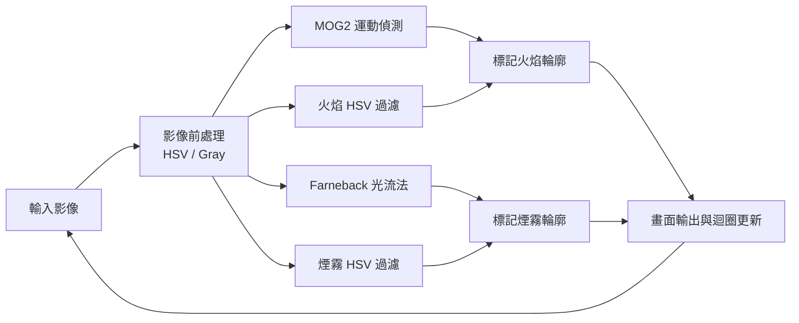
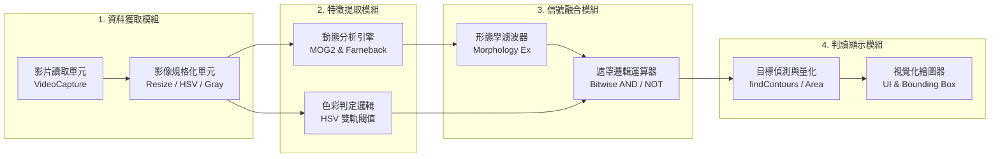

# 火災與煙霧偵測系統
## 1. 專案概述　
本專案旨在開發一個能即時偵測影片中「火焰」與「煙霧」的視覺系統。透過結合運動偵測（光流法）與顏色特徵分析，系統需標記目標位置並輸出邊界框（Bounding Box），同時針對 Raspberry Pi 4B 等嵌入式硬體進行效能優化。
### 2.1 影像輸入與預處理
*   **影像來源**： `.mp4`
*   **解析度調整**：系統應將輸入影像縮放至指定尺寸`680×480`

### 1. 運動區域檢測 (Motion Detection) 雙軌化
- **火焰偵測**：導入 `MOG2` 背景相減法。利用其極低的運算開銷與自適應學習能力，快速抓取原地高頻閃爍的火焰輪廓。
- **煙霧偵測**：保留 `Farneback 稠密光流法`。專注處理邊緣模糊、緩慢擴散的流體特性，並透過形態學（Dilate / Close）將稀疏的動態像素黏合成完整的區塊。
### 2. 色彩特徵分析 (Color Analysis) 輕量化
- 捨棄耗費硬體資源的 RGB 浮點數比例運算，全面改用 **HSV 色彩空間**。
- **火焰特徵**：鎖定紅橘色相 (H)，嚴格要求高飽和度 (S) 與高亮度 (V)，精準捕捉發光體。
- **煙霧特徵**：不限制色相，鎖定極低飽和度 (S < 45) 區域，涵蓋深灰到純白。
### 3. 邏輯融合與幾何過濾 (Logic Fusion & Shape Filtering)
- **特徵交集**：使用 `bitwise_and` 融合運動與顏色遮罩，排除靜態紅/灰物體。
- **防呆互斥機制**：在煙霧判斷階段，強制排除火焰的專屬顏色區域 (`bitwise_not`)，解決火煙重疊時的誤判問題。
## 實作待辦清單
- [ ] 移除舊版的 RGB 通道拆分與除法邏輯。
- [ ] 實作影像轉 HSV 空間與 `cv2.inRange()` 閥值設定。
- [ ] 實作 MOG2 背景相減器並套用於火焰動態檢測。
- [ ] 調整 Farneback 光流參數（縮小 iterations / levels）並套用於煙霧檢測。
- [ ] 實作遮罩交集與火煙互斥邏輯。
- [ ] 驗證並記錄 Raspberry Pi 上的 FPS 效能變化。
## ３. 目前效果

## ４. 系統流程圖

## ５. 系統架構圖

